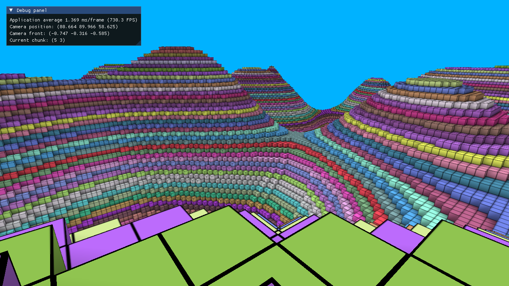

# Voxel Engine

Small Minecraft-like Voxel Engine created in free time as hobby project using C++ and OpenGL.
The project is currently on hold, however I'm planning to come back here.

## Features
- Movable camera
- Chunk generation using perlin noise
- Face culling
- Shading with ambient occlusion

